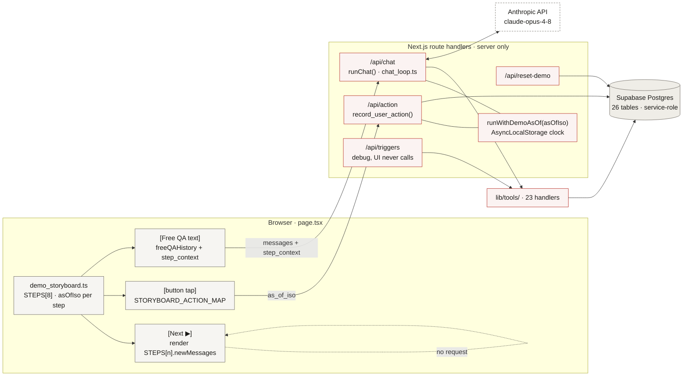
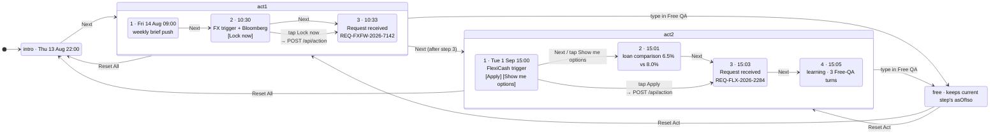

# CIMB CFO Agent — Code Map and Integration Seams

**Audience.** The engineering team that will host this demo on its own platform, replace the front end, and possibly reconfigure the agent.
**Scope.** Where every file lives, what each one does, and exactly which contracts and seams you touch for (a) a new front end and (b) a changed agent.
**Ground truth.** Line counts and contracts were read from the code on 2026-09-17 at commit `1b5916a`. When this document and the code disagree, the code wins — then fix the document.

---

## Terms used in this document

Project words that are not industry terms, defined once. Code identifiers keep their names.

| term | meaning |
|---|---|
| **storyboard / scripted step** | The 8 pre-written demo steps in `demo_storyboard.ts`. Their agent messages are fixed text; no model call produces them. |
| **Free QA** | Anything the customer types instead of pressing Next. These turns go to the model. |
| **Push / Pull** | Push: the agent speaks first (weekly brief, FX alert, credit alert). Pull: the customer asks and the agent answers. |
| **weekly brief** | The Monday-morning summary push. Named `monday_brief` in code. |
| **demo clock / `asOfIso`** | The timestamp each scripted step treats as "now". Time-dependent reads filter on it so an Act 2 question reads Act 2's data. |
| **RM gate** | A code check on the model's final reply. If the reply claims a request is complete when it only needs relationship-manager review, the reply is replaced with a fixed template. |
| **`pending_rm_review`** | The only status a Lock or Apply can write. A relationship manager finalises the request outside the agent. |
| **allow-list** | The 12 action ids the model may attach to a reply as a button (`ALLOWED_LLM_ACTIONS`). Anything else is dropped. |
| **SME maturity tier** | A 1–5 band from CIMB's SME maturity model. Products carry the tier range they suit (`min/max_complexity_level`); the customer's inferred tier (4) filters recommendations. It is a product-suitability band, not a credit rating. |
| **RM** | Relationship manager — the bank employee who finalises any request the agent records. |
| **the model / the agent** | *The model* is the language model (`claude-opus-4-8`). *The agent* is the whole system: model, persona, tools, gates and data. |

---

## 1. Repository map

```
w04/                                   lines  role
├── web/                                      Next.js 15 app (App Router). Everything runs here.
│   ├── app/
│   │   ├── page.tsx                    510   The front end. All UI state, storyboard driver,
│   │   │                                     Free-QA sender, button handler. Replace this.
│   │   ├── layout.tsx                   14   HTML shell.
│   │   ├── globals.css                 636   WhatsApp-style theme.
│   │   └── api/                              SERVER. Keep these; they are your integration surface.
│   │       ├── chat/route.ts            81   POST /api/chat     — the agent (model loop)
│   │       ├── action/route.ts          73   POST /api/action   — button side-effects (DB writes)
│   │       ├── reset-demo/route.ts      91   POST /api/reset-demo — wipe demo residue
│   │       └── triggers/route.ts        84   POST /api/triggers — debug only, UI never calls it
│   ├── components/                           Presentational pieces used by page.tsx only.
│   │   ├── Phone.tsx                    70   Chat column container
│   │   ├── MessageBubble.tsx            67   One bubble; renders `actions[]` as buttons
│   │   ├── FreeQAHistory.tsx            43   Free-QA turns list
│   │   ├── ContextPanel.tsx            134   Right panel, 3 zones
│   │   ├── SankeyTrace.tsx             265   Zone 3 — draws the step's SCRIPTED toolTrace
│   │   ├── ScenarioTabs.tsx             90   Act1 / Act2 / Free tabs
│   │   └── DemoControls.tsx             88   Next ▶, Jump, Reset Act, Reset All, Reset DB
│   ├── lib/                                  Server-side agent core (except demo_storyboard.ts)
│   │   ├── chat_loop.ts                272   runChat(): system prompt assembly, tool loop,
│   │   │                                     suggest_action allow-list, RM gate
│   │   ├── persona.ts                   56   System prompt text (tone, modes, rules)
│   │   ├── tool_schemas.ts             255   The 24 tool definitions the model sees
│   │   ├── anthropic.ts                 27   SDK client, MODEL_ID, prompt-cache helper
│   │   ├── supabase.ts                  39   DB client (service role) + the demo clock
│   │   ├── demo_storyboard.ts          576   CLIENT data: 8 scripted steps, per-step asOfIso
│   │   └── tools/                            23 handlers = what the model can actually do
│   │       ├── index.ts                 58   TOOL_HANDLERS registry + dispatchTool()
│   │       ├── balance.ts               48   get_current_balance, get_account_list
│   │       ├── transactions.ts          66   get_recent_transactions, get_scheduled_payments
│   │       ├── forecasts.ts            117   get_forecasted_payments, get_expected_inflows,
│   │       │                                 get_cashflow_projection
│   │       ├── credit.ts                46   get_credit_limits, get_preapproved_offers
│   │       ├── products.ts              67   5 catalog/pricing lookups
│   │       ├── company.ts               52   get_company_profile, get_seasonality, get_top_counterparties
│   │       ├── bloomberg.ts             69   get_bloomberg_market_context
│   │       ├── triggers.ts             153   check_monday_brief, check_fx_opportunity,
│   │       │                                 check_flexicash_opportunity
│   │       └── actions.ts              191   record_user_action, record_learning_event  (WRITE)
│   ├── tests/e2e/cimb-cfo-agent.spec.ts 210  Playwright, runs against the deployed URL
│   ├── playwright.config.ts             23
│   ├── package.json                     37
│   ├── next.config.js                   11
│   ├── tsconfig.json                    23
│   └── .env.local.example               12   Copy to .env.local
├── supabase/migrations/                      Postgres schema + data. Apply in number order.
│   ├── 0001_initial_schema.sql         728   25 tables, 33 enums
│   ├── 0002_seed_data.sql             2077   Synthetic 12-month history for one customer
│   ├── 0003_pending_rm_review_status.sql  5  Adds enum value pending_rm_review to 3 status types
│   ├── 0004_bloomberg_market_snapshots.sql 25  26th table + 2 seed snapshots (external market feed)
│   ├── 0005_shift_seed_timestamps.sql  294   Date shift +35 days, two-pass (park +10000, pull back)
│   ├── 0006_lafont_eur_currency_fix.sql 31   Domaine Lafont rows: currency MYR → EUR, amounts recomputed via fx_rate
│   ├── 0007_bloomberg_article_metadata.sql 26  Adds news_article_url, news_summary, news_published_at
│   ├── 0008_product_rate_updates.sql    56   FlexiCash 8.5 → 6.5, Working Capital 7.2 → 8.0,
│   │                                         Trade Bridging Loan removed, offer_terms updated
│   ├── 0009_wcf_rename_to_revolving_credit.sql 24  Display name "Working Capital Facility" →
│   │                                         "Revolving Credit (auto-enrollment)"; product_id unchanged
│   ├── 0010_shift_timestamps_plus_18d.sql 275  Date shift +18 days, two-pass
│   └── 0011_shift_timestamps_plus_14d.sql 282  Date shift +14 days, two-pass (current anchor: 2026-08-14)
└── scripts/
    ├── shift_demo_dates.mjs            160   Move every date in the DB by N days (two-pass)
    └── generate_synthetic.py          1532   Regenerate the seed from scratch
```

**Three facts that shape everything else**

1. `page.tsx` is the only file that knows the storyboard. The server does not know which step the demo is on unless the client tells it (`step_context`).
2. The server has no session store. `SESSION_ID` is a constant string in `page.tsx`; the DB holds exactly one customer's state.
3. Every date-dependent read (11 of the 23 handlers — balances, transactions, forecasts, pricing, market snapshot, triggers) is filtered by a "demo clock" (`asOfIso`) that the client sends per request. Send the wrong clock and the agent reads the wrong month. The other 12 read current state (limits, offers, holdings, profile, catalog) regardless of clock.

---

## 2. Runtime map, as built

Layered the way an agent platform is usually drawn — strategy, planning, execution, platform — so the gaps read as clearly as the parts. `◆` marks a behaviour the code enforces; everything else is prompt text or convention.

```
2026 · CIMB CFO AGENT · AS BUILT (commit 1b5916a)
STRATEGY
┌──────────────┐ tap · type ┌──────────────────────────────────────────────────┐    ┌──────────────────────────────┐
│  SME owner   │───────────►│ Demo shell · page.tsx (client)                   │    │ Memory (DB rows)             │
│  Ahmad only  │            │ storyboard 8 steps · asOfIso per step            │    │ infer_user_preferences       │
└──────────────┘            │ [Next] scripted · [button] map · [text] Free QA  │    │ infer_learning_events        │
                            └───────────────────────┬──────────────────────────┘    │ confirmed_by_user = true     │
                                                    │ POST /api/chat                │ (hard-coded in tool)         │
                                                    │ messages (Free-QA only)       └──────────────▲───────────────┘
                                                    │ + step_context{asOfIso…}                     │ record_learning_event
                            ┌───────────────────────▼──────────────────────────┐    ┌──────────────┴───────────────┐
                            │ CFO Agent · chat_loop.ts (server)                │◄──►│ Learning loop (prompt only)  │
                            │ claude-opus-4-8 · persona 56 lines (cached)      │    │ paraphrase → confirm → save  │
                            │ Push / Pull · tool loop ≤ 6 · 24 tool schemas    │    │ 3-turn gate not enforced     │
                            │ ◆ allow-list 12 · ◆ RM gate (2 regex)            │    └──────────────────────────────┘
                            └───────────────────────┬──────────────────────────┘
PLANNING · triggers 3 (live tools — the storyboard pushes on screen are scripted text)
               ┌────────────────────────────────────┼─────────────────────────────────┐
               ▼                                    ▼                                 ▼
┌──────────────────────────┐        ┌──────────────────────────┐        ┌──────────────────────────┐
│ check_monday_brief       │        │ check_fx_opportunity     │        │ check_flexicash_opp.     │
│ always fires · 7d proj   │        │ EUR forecast ≤ 14d  AND  │        │ dip flag (21d proj) AND  │
│ overdue · 3-day FX delta │        │ mid ≥ 2.0% over 90d avg  │        │ open FlexiCash offer     │
└────────────┬─────────────┘        └────────────┬─────────────┘        └────────────┬─────────────┘
EXECUTION    │  tools/ · 23 handlers · 11 read the demo clock (lte asOf) · 2 write    │
┌────────────▼─────────────┐        ┌────────────▼─────────────┐        ┌────────────▼─────────────┐
│ bank_* · 15 tables       │        │ bloomberg_market_        │        │ bank_product_catalog     │
│ accounts · balances ·    │        │ snapshots · 2 rows       │        │ pricing_daily · offers   │
│ transactions · fx_rates… │        │ news + FX percentile     │        │ credit_limits · holdings │
└────────────┬─────────────┘        └──────────────────────────┘        └────────────┬─────────────┘
             │                                                                       │
┌────────────▼───────────────────────────────────────────────────────────────────────▼─────────────┐
│ infer_* · 10 tables — counterparties · forecasted_payments · expected_inflows · cashflow_projection│
│ seasonality · company_profile … · SEEDED by migration 0002 — nothing computes them at runtime     │
└────────────────────────────────────────┬─────────────────────────────────────────────────────────┘
                                         │ POST /api/action  (Lock · Apply)  ◆ as_of_iso
┌────────────────────────────────────────▼─────────────────────────────────────────────────────────┐
│ RM handoff — rows land with ◆ status = pending_rm_review · nothing downstream · Reset DB clears   │
└──────────────────────────────────────────────────────────────────────────────────────────────────┘
┌ platform · always on ┄┄┄┄┄┄┄┄┄┄┄┄┄┄┄┄┄┄┄┄┄┄┄┄┄┄┄┄┄┄┄┄┄┄┄┄┄┄┄┄┄┄┄┄┄┄┄┄┄┄┄┄┄┄┄┄┄┄┄┄┄┄┄┄┄┄┄┄┄┄┄┄┄┄┄┄┐
┆ LLM     Anthropic API direct · prompt cache on persona prefix · no gateway · no rate limit · no cost  ┆
┆ Audit   every user / agent turn → bank_interactions · tool_calls[] returned to UI, not persisted     ┆
┆ Hosting Vercel (web) · Supabase free tier — pauses after 7 idle days · service-role key · no RLS     ┆
└┄┄┄┄┄┄┄┄┄┄┄┄┄┄┄┄┄┄┄┄┄┄┄┄┄┄┄┄┄┄┄┄┄┄┄┄┄┄┄┄┄┄┄┄┄┄┄┄┄┄┄┄┄┄┄┄┄┄┄┄┄┄┄┄┄┄┄┄┄┄┄┄┄┄┄┄┄┄┄┄┄┄┄┄┄┄┄┄┄┄┄┄┄┄┄┄┄┄┘
· 1 loop, not 3 tiers · one session · one customer · demo clock per step · scripted + improvised · evals by hand
```

Three things to read off it:

1. **The PLANNING layer is three functions, not three agents.** There is no delegation; `chat_loop.ts` calls them as tools. Hence "1 loop, not 3 tiers".
2. **The two right-hand boxes differ in strength.** Memory exists as DB rows. The learning loop's "confirm before save" is a persona sentence, so it carries no `◆`.
3. **The platform band is thin.** No gateway, no rate limit, no cost attribution, no tracing store — only per-turn audit rows and a prompt cache.

---

## 3. Server API contracts

All four are `POST`, JSON in, JSON out, no auth, no session. Errors return `{ "error": string }` with HTTP 400/500; in production builds `/api/chat` masks the message as `"internal_error"`.

### 3.1 `POST /api/chat` — talk to the agent

Request:

```jsonc
{
  "messages": [                       // REQUIRED. The conversation so far, oldest first.
    { "role": "user",      "content": "Has Café Lumière been late before?" },
    { "role": "assistant", "content": "…previous agent reply…" },
    { "role": "user",      "content": "show me their transactions" }
  ],
  "session_id": "demo_session_001",  // optional; only stamped onto bank_interactions rows
  "step_context": {                   // optional but in practice REQUIRED for correct answers
    "activeMode": "act1",             // "intro" | "act1" | "act2" | "free"
    "stepWithinAct": 1,               // omit in free mode
    "timeStamp": "Fri 14 Aug · 09:00",// display label; goes into the system prompt as-is
    "narrative": "Monday morning brief fires automatically.",
    "recentPushText": "Good morning, Mr. Bakri. …",   // the push currently on screen
    "asOfIso": "2026-08-14T01:00:00Z" // THE DEMO CLOCK. Tools filter lte(this date).
  }
}
```

Response:

```jsonc
{
  "reply": "Looking at Café Lumière's history, Mr. Bakri: …",   // final text. May be the RM gate's fixed template.
  "tool_calls": [                                                // every tool the model ran, in order
    { "name": "get_expected_inflows", "input": { "days_ahead": 14 }, "result": { … } }
  ],
  "stop_reason": "end_turn",         // "end_turn" | "max_iterations"
  "actions": [                       // buttons the model asked for, already checked against the allow-list
    { "label": "Compare with limit order", "action_id": "show_alternatives", "variant": "secondary", "payload": null }
  ]
}
```

What the server does with it, in order (`chat/route.ts` → `chat_loop.ts`):

1. Pins `step_context.asOfIso` for the whole request (`runWithDemoAsOf`, `AsyncLocalStorage`). Absent → falls back to `DEMO_INITIAL_TIMESTAMP` env, then to a constant.
2. Inserts the last user message into `bank_interactions`.
3. Builds the system prompt: persona (cached) + demo timestamp + scenario block (if `step_context`) + "most recent push" block (if `recentPushText`).
4. Runs up to 6 model turns. `suggest_action` tool calls are intercepted and filtered against `ALLOWED_LLM_ACTIONS`; all other tools dispatch to `TOOL_HANDLERS` in parallel; results go back to the model as `tool_result` JSON.
5. On the final text, applies the RM gate: if a gated action (`accept_preapproved_offer`, `lock_fx_forward`) was emitted **and** the text claims completion or is boilerplate-only, the text is replaced by a fixed "tap the button, your RM will contact you" sentence.
6. Inserts the reply into `bank_interactions` and returns.

**Two rules the current client follows that a new client must keep**

- **History = Free-QA turns only.** Scripted push messages (rendered from `STEPS[n].newMessages`) are **not** included in `messages`. Including them made the model "remember" saying things it never generated. Instead, send the current push as `recentPushText`.
- **`asOfIso` = the active step's clock, every time.** Act 2 questions with an Act 1 clock read the wrong cashflow snapshot and contradict the storyboard.

### 3.2 `POST /api/action` — a button was tapped

Request:

```jsonc
{
  "action_type": "accept_preapproved_offer",   // "lock_fx_forward" | "accept_preapproved_offer" | "decline_offer" | other
  "referenced_entity_type": "preapproved_offer",
  "referenced_entity_id": "offer_flx_001",
  "details": { "product": "flexicash", "amount": 65000 },   // free-form; see per-action keys below
  "session_id": "demo_session_001",
  "as_of_iso": "2026-09-01T07:03:00Z"           // demo clock for the rows this writes
}
```

Response:

```jsonc
{
  "recorded": true,
  "action": {                                   // record_user_action() return value
    "recorded": true, "interaction_id": "int_…", "action_type": "accept_preapproved_offer",
    "activation_ref": "FLX-2026-9285", "approved_amount": 65000, "currency": "MYR", "interest_rate_pa": 6.5
  },
  "confirmation_message": "Request received. Reference: REQ-FLX-2026-9285. …"   // model-written; the current front end does not use it
}
```

Side effects by `action_type` (`lib/tools/actions.ts`):

| action_type | writes | notes |
|---|---|---|
| any | `bank_interactions` (1 row, `interaction_type` lock/apply/click) | always |
| `lock_fx_forward` | `bank_scheduled_payments` (1 row, `status = pending_rm_review`) | `details.amount_eur`, `details.rate`, `details.value_date` — defaults 8200 / 4.95 / 2026-08-23 |
| `accept_preapproved_offer` | `bank_preapproved_offers` → `accepted`; `bank_products_held` + `bank_credit_limits` (1 row each, `pending_rm_review`) | amount, currency and rate are read from the offer row (`offer_terms.interest_rate_pa`) |
| `decline_offer` | interaction row only | `confirmation_message` = one-sentence acknowledgement |

Nothing here is "activated". Every business row lands as `pending_rm_review`; the narrative is that a relationship manager finalises it.

### 3.3 `POST /api/reset-demo` — clean up between runs

No body. Response:

```jsonc
{ "reset": true, "offer_status_restored": true,
  "deleted": { "bank_products_held": 0, "bank_credit_limits": 1, "bank_scheduled_payments": 0,
               "bank_interactions": 21, "infer_user_preferences": 3, "infer_learning_events": 3 } }
```

Deletes rows whose ids start with `ph_flx_`, `cl_flx_`, `sched_fx_`, `int_`, `pref_`, `le_`; deletes any `pending_rm_review` row in three tables; sets `offer_flx_001` back to `open`. Seed rows (non-prefixed ids) are untouched. Idempotent — call it before every run.

### 3.4 `POST /api/triggers` — debug

`{ "trigger": "monday_brief" | "fx" | "flexicash" }` → `{ "fires": bool, "payload": {…}, "message": "…" }`. Evaluates one trigger and asks the model to phrase the push. **The UI does not call this**; the storyboard hard-codes the push text. It has no `asOfIso` plumbing, so it evaluates at the env-default clock. Useful for checking trigger logic, not for the demo.

---

## 4. What the front end owns today — reproduce or consciously drop

If you replace `page.tsx`, this is the behaviour that lives there and nowhere else:

| # | Behaviour | Where | Keep? |
|---|---|---|---|
| F1 | The 8-step script: text, timestamps, `asOfIso`, action buttons, right-panel content | `lib/demo_storyboard.ts` `STEPS[]` | Yes — this **is** the demo. Port the data, not the React. |
| F2 | Clock threading: send `STEPS[n].asOfIso` as `step_context.asOfIso` on every `/api/chat`, and as `as_of_iso` on `/api/action` | `page.tsx` `handleSendMessage`, `STORYBOARD_ACTION_MAP.apiCall` | Yes, non-negotiable |
| F3 | History policy: `messages` = Free-QA turns only; current push goes in `recentPushText` | `page.tsx` `freeQAHistory` | Yes |
| F4 | Button routing: `STORYBOARD_ACTION_MAP` maps 3 ids to (act, step, optional API call); any other `action_id` (i.e. model-suggested) becomes a Free-QA message `"Please walk me through: <label>."` | `page.tsx` `handleAction` | Yes for the 3 mapped ids; the fallback phrasing may be changed |
| F5 | Rendering `actions[]` from `/api/chat` as tappable buttons inside the reply bubble | `MessageBubble.tsx` | Yes, or model-suggested buttons vanish |
| F6 | Disabling a button after one tap | `page.tsx` `disabledActions` | Recommended; the server does not de-duplicate |
| F7 | Reset Act / Reset All (client state) and Reset DB (`/api/reset-demo`) | `DemoControls.tsx` | Reset DB yes; the other two are client concerns |
| F8 | Right panel Zone 3 "Tool & DB Trace" — drawn from `STEPS[n].toolTrace`, a **scripted** array. The real `tool_calls[]` from `/api/chat` is not used | `SankeyTrace.tsx` | Decide. Wiring it to the real `tool_calls[]` would show the calls actually made. |
| F9 | `SESSION_ID = "demo_session_001"` constant | `page.tsx` | Decide. Replace with an id per browser session if two people may demo at once — but the DB still holds one customer's state, so concurrent runs will still collide on `reset-demo` and pending rows |

The storyboard action map, verbatim:

```ts
lock_fx_forward          → act1, step 3, POST /api/action { action_type, referenced_entity_id: "fx_opp_eval_2026-08-14",
                                                             details: { amount_eur: 8200, rate: 4.95, value_date: "2026-08-23" } }
accept_preapproved_offer → act2, step 3, POST /api/action { referenced_entity_id: "offer_flx_001", details: { product: "flexicash", amount: 65000 } }
show_loan_options        → act2, step 2, no API call
```

---

## 5. Agent configuration seams (server side)

Everything the agent *is* sits in five files under `web/lib/`. They are intentionally simple: no framework, no abstraction layer, one SDK call.

### 5.1 `persona.ts` — what the agent is like

One exported string, 56 lines, cached as a prompt prefix. Sections: Tone and Style · Push vs Pull · Tool Use · Recommendation Rules · Compliance · Learning Behaviour · Identity. Edit text, redeploy.

Caution: several behaviours the demo relies on are enforced **only** here — "paraphrase, ask, commit only after the user confirms", the "Informational. Subject to product terms and approval." footer, "do not invent figures". Five attempts to add stricter rules regressed other answers and were rolled back; change one rule at a time and re-run the scripted questions in `docs/demo/`.

### 5.2 `tool_schemas.ts` + `tools/index.ts` + `tools/*.ts` — what the agent can do

Three places must agree on a tool's name:

```
tool_schemas.ts   { name: 'get_x', description, input_schema }   ← the model sees this
tools/index.ts    TOOL_HANDLERS = { get_x, … }                    ← name → function
tools/<file>.ts   export async function get_x(args) { … }         ← does the work
```

**Recipe — add a tool.** (1) Write the handler in the right `tools/*.ts`; read the clock with `getDemoCurrentTimestamp()` and filter `lte(asOf)`. (2) Register it in `TOOL_HANDLERS`. (3) Add its schema to `TOOL_SCHEMAS`. Return plain JSON; the loop serialises it for the model. Throwing is safe — `dispatchTool` returns `{ error: "tool_execution_failed" }` to the model instead of crashing the request.

**Recipe — remove a tool.** Delete the schema entry. The handler can stay; the model cannot call what it cannot see.

Special cases: `suggest_action` has a schema but no handler — `chat_loop.ts` intercepts it. `record_user_action` and `record_learning_event` **write**; the model can call them. If your platform must not let the model write, remove their schemas and keep the writes behind `/api/action`.

### 5.3 `chat_loop.ts` — how a turn runs

Knobs, with current values:

| knob | value | line |
|---|---|---|
| `MAX_TOOL_LOOPS` | 6 | 12 |
| `max_tokens` per model call | 2048 | 161 |
| `ALLOWED_LLM_ACTIONS` — action ids the model may put on a button | 12 ids | 56 |
| `GATED_ACTIONS` — ids that trigger the RM gate | `accept_preapproved_offer`, `lock_fx_forward` | 186 |
| `COMPLIANCE_ONLY`, `DANGEROUS_COMPLETION` — the gate's regexes | tuned to Claude's phrasing | 190–191 |
| RM gate template reply | "Sure, Mr. Bakri — tap **{label}** below …" | 196 |
| system block assembly | `buildSystemBlocks()` | 94 |

**Recipe — allow a new model-suggested button.** Add the id to `ALLOWED_LLM_ACTIONS`; teach the front end what tapping it does (F4). Nothing else.

**Recipe — change what the model is told about the scenario.** Edit `buildSystemBlocks()`. The "Demo Scenario Context" and "Most Recent Push" blocks are built from `step_context`, so the front end controls their content without a server change.

### 5.4 `anthropic.ts` — which model, which provider

`MODEL_ID = 'claude-opus-4-8'`, `cacheControl()` marks the persona block for prompt caching. Five files import the SDK: this one, `chat_loop.ts`, `tool_schemas.ts` (types only), `api/action/route.ts`, `api/triggers/route.ts`.

**Recipe — move to Bedrock or another provider.** Two layers. Layer 1 is mechanical (~1 day): replace the client, map `system`/`tools`/`tool_use`/`tool_result` to the target's shapes, drop `cache_control`. Layer 2 is behavioural and open-ended: the persona and the two gate regexes were tuned against Claude's output. Re-run every scripted question in `docs/demo/` and expect to re-tune.

### 5.5 `supabase.ts` — where data lives, what time it is

Creates the `@supabase/supabase-js` client with the **service-role** key (bypasses RLS — server only). Exposes `runWithDemoAsOf()` / `getDemoCurrentTimestamp()` — the demo clock — and `DEMO_CUSTOMER_ID` (`ahmad_01`).

**Recipe — move to your own Postgres.** 14 files import this client and use the PostgREST query builder (`.from().select().eq().lte().order()`). Options: (a) run PostgREST in front of your Postgres and keep the code; (b) rewrite the 23 handlers against `pg`/Prisma — they are short and uniform (read clock → filter → return JSON). Keep `runWithDemoAsOf` regardless; it is the mechanism that makes a scripted demo consistent.

**Known defect here.** Line 36 uses `??`, so an env var set to an empty string is *not* treated as missing and the clock becomes `""`. Either unset the var or change `??` to `||`.

---

## 6. Environment

| variable | required | used by |
|---|---|---|
| `NEXT_PUBLIC_SUPABASE_URL` | yes | `supabase.ts` (throws if missing) |
| `SUPABASE_SERVICE_ROLE_KEY` | yes | `supabase.ts` (throws if missing) |
| `ANTHROPIC_API_KEY` | yes | `anthropic.ts` (throws if missing) |
| `DEMO_CUSTOMER_ID` | no, default `ahmad_01` | `supabase.ts` |
| `DEMO_INITIAL_TIMESTAMP` | no, default in code | `supabase.ts` — fallback clock when the client sends none |
| `NEXT_PUBLIC_DEMO_MODE` | no | not read by the app |
| `NEXT_PUBLIC_SUPABASE_ANON_KEY` | no | not read by the app |
| `SUPABASE_ACCESS_TOKEN`, `SUPABASE_DB_PASSWORD` | no | `scripts/` only, never the app |

---

## 7. Known issues you will meet in the first week

1. **The Sankey panel is scripted** (F8). Don't demo it as "live tool calls" unless you wire it to `tool_calls[]`.
2. **The model can write.** `record_user_action` is callable by the model; the RM gate changes the reply text, not the tool call. Rows land as `pending_rm_review`, so nothing is "executed", but audit it.
3. **The RM gate regexes are Claude-specific.** A different model's phrasing may fail to match them, or match when it should not.
4. **One shared session, one customer.** Two simultaneous demos overwrite each other's pending rows and reset each other.
5. **Playwright asserts display dates** (`Jul …`) from an earlier data shift; 6 of 9 tests fail until the assertions read from `STEPS[]`.
6. **Data is dated.** Every table is anchored to Act 1 = 2026-08-14 / Act 2 = 2026-09-01. `scripts/shift_demo_dates.mjs <days>` moves it; the four code files that carry literal dates are listed in `docs/04-runbook.md`.
7. **The `/api/action` confirmation text costs one model call whose result the front end does not use.** Delete the call or use the text.

---

## 8. Diagrams

Four views, all Mermaid so they render on GitHub and diff in git. Six earlier diagrams (concept, storyline, tables) live in `docs/demo/*.mmd`.

### 8.1 Containers and the three entry paths



### 8.2 One Free-QA turn

```mermaid
%%{init: {"themeVariables": {"fontSize": "18px"}, "sequence": {"actorFontSize": 18, "messageFontSize": 16, "noteFontSize": 16, "width": 190, "height": 52, "boxMargin": 12, "messageMargin": 40}}}%%
sequenceDiagram
  autonumber
  participant UI as page.tsx
  participant API as /api/chat
  participant Loop as runChat()
  participant LLM as Claude
  participant Tools as lib/tools
  participant DB as Postgres

  UI->>API: POST {messages (Free-QA only), session_id, step_context{asOfIso, recentPushText…}}
  API->>API: runWithDemoAsOf(asOfIso)
  API->>DB: INSERT bank_interactions (user turn)
  API->>Loop: runChat(history, step_context)
  Loop->>Loop: system = persona(cached) + clock + scenario + recent push
  loop up to 6 times
    Loop->>LLM: messages.create({system, tools[24], messages})
    alt stop_reason = tool_use
      LLM-->>Loop: tool_use blocks
      par each block
        Loop->>Loop: suggest_action? → allow-list(12) → actions[]
        Loop->>Tools: dispatchTool(name, input)
        Tools->>DB: select … lte(asOf)
        DB-->>Tools: rows
        Tools-->>Loop: JSON (or {error})
      end
      Loop->>Loop: messages += assistant tool_use + user tool_result
    else stop_reason = end_turn
      LLM-->>Loop: text
      Loop->>Loop: RM gate: gated action ∧ (completion claim ∨ boilerplate) → template text
    end
  end
  Loop-->>API: {reply, tool_calls[], actions[], stop_reason}
  API->>DB: INSERT bank_interactions (agent turn)
  API-->>UI: JSON
  UI->>UI: render reply · actions[] as buttons · append to freeQAHistory
```

### 8.3 Storyboard state machine



Every step carries its own `asOfIso`; Free QA inherits the step it was typed on. Reset Act rewinds the current act to step 1; Reset All returns to intro; neither touches the DB — that is Reset DB (`/api/reset-demo`).

### 8.4 Tables and their keys

```mermaid
%%{init: {"themeVariables": {"fontSize": "18px"}, "er": {"fontSize": 16, "entityPadding": 18, "minEntityWidth": 140}}}%%
erDiagram
  bank_customers ||--o{ bank_accounts : owns
  bank_customers ||--o{ bank_balances_daily : has
  bank_accounts  ||--o{ bank_balances_daily : "EOD snapshot (unique per account+date)"
  bank_customers ||--o{ bank_transactions : has
  bank_accounts  ||--o{ bank_transactions : posts
  bank_customers ||--o{ bank_scheduled_payments : registers
  bank_accounts  ||--o{ bank_scheduled_payments : debits
  bank_transactions |o--o| bank_scheduled_payments : "linked_transaction_id"
  bank_customers ||--o{ bank_products_held : holds
  bank_product_catalog ||--o{ bank_products_held : "product_id"
  bank_accounts  |o--o{ bank_products_held : "account_id (nullable)"
  bank_products_held ||--o{ bank_credit_limits : "product_holding_id"
  bank_customers ||--o{ bank_credit_limits : has
  bank_credit_limits ||--o{ bank_credit_drawdowns : "credit_limit_id"
  bank_customers ||--o{ bank_preapproved_offers : receives
  bank_product_catalog ||--o{ bank_product_pricing_daily : "pricing_date rows"
  bank_customers ||--o{ bank_products_history : has
  bank_customers ||--o{ bank_rm_assignments : has
  bank_customers ||--o{ bank_interactions : "chat + click log"
  bank_fx_rates {
    text pair
    timestamptz ts
  }
  bloomberg_market_snapshots {
    text fx_pair
    timestamptz as_of_timestamp
  }

  bank_customers ||--o{ infer_counterparties : "resolved from counterparty_raw_text"
  bank_transactions ||--|| infer_transaction_enrichment : "PK = transaction_id"
  infer_counterparties |o--o{ infer_transaction_enrichment : "inferred_counterparty_id"
  bank_customers ||--o{ infer_forecasted_payments : has
  infer_counterparties |o--o{ infer_forecasted_payments : "based_on_counterparty_id"
  bank_customers ||--o{ infer_expected_inflows : has
  infer_counterparties |o--o{ infer_expected_inflows : "based_on_counterparty_id"
  bank_customers ||--o{ infer_cashflow_projection : "pre-batched snapshots"
  bank_customers ||--|| infer_company_profile : "one per customer"
  bank_customers ||--o{ infer_seasonality : has
  bank_customers ||--o{ infer_user_preferences : "learned, user_explicit"
  bank_interactions ||--|| infer_interaction_enrichment : "PK = interaction_id"
  bank_customers ||--o{ infer_learning_events : "audit trail"
  bank_interactions |o--o{ infer_learning_events : "source_interaction_id"
```



`bank_*` (15) is what core banking would own; every `infer_*` (10) row carries `confidence`, `inferred_by`, `inferred_at`, `evidence_source`. `bank_fx_rates` and `bloomberg_market_snapshots` are firm-wide — no `customer_id`.

---

## 9. Tool catalog

What the model can call, what it gets back, and where the data comes from. `clock` = the handler filters by `getDemoCurrentTimestamp()`. `writes` = the handler inserts or updates. Argument defaults are the handler's, not the schema's.

| tool | arguments | returns (top-level) | reads | writes | clock |
|---|---|---|---|---|---|
| `get_current_balance` | — | `{ as_of, balances[] }` — latest EOD `closing_balance` per non-closed account | `bank_accounts`, `bank_balances_daily` | | ✓ |
| `get_account_list` | — | `{ accounts[] }` non-closed, primary first | `bank_accounts` | | |
| `get_scheduled_payments` | `from_date` (=today), `to_date` (=+30d) | `{ window, count, scheduled_payments[] }` excludes `cancelled` | `bank_scheduled_payments` | | ✓ |
| `get_recent_transactions` | `days` (=30), `currency` | `{ window, count, transactions[] }` each with `inferred_counterparty_id`, `inferred_category`; max 200 rows | `bank_transactions`, `infer_transaction_enrichment` | | ✓ |
| `get_products_held` | — | `{ count, products_held[] }` `status = active` only — `pending_rm_review` rows are invisible here | `bank_products_held` | | |
| `get_forecasted_payments` | `days_ahead` (=30), `currency` | `{ window, count, forecasts[] }` each with `counterparty{resolved_name, country, industry}`; `status = active` | `infer_forecasted_payments`, `infer_counterparties` | | ✓ |
| `get_expected_inflows` | `days_ahead` (=30), `include_overdue` (=true) | `{ window, count, inflows[] }` each with `counterparty_name`, `days_overdue` | `infer_expected_inflows`, `infer_counterparties` | | ✓ |
| `get_cashflow_projection` | `horizon_days` (=7) | `{ requested_horizon_days, projection, note }` — picks the pre-batched snapshot whose horizon is closest; does not compute | `infer_cashflow_projection` | | ✓ |
| `get_company_profile` | — | `{ kyc_declared, inferred }` latest `version` | `infer_company_profile`, `bank_customers` | | |
| `get_seasonality` | — | `{ count, patterns[] }` by confidence desc | `infer_seasonality` | | |
| `get_top_counterparties` | `type`, `limit` (=5) | `{ type_filter, count, counterparties[] }` by `avg_amount` desc, active only | `infer_counterparties` | | |
| `get_credit_limits` | — | `{ count, limits[] }` each with `product_name` joined from holdings; `status = active` only | `bank_credit_limits`, `bank_products_held` | | |
| `get_preapproved_offers` | — | `{ count, offers[] }` `status = open` only, includes `offer_terms` | `bank_preapproved_offers` | | |
| `check_monday_brief` | — | `{ trigger_fires: true, as_of, payload{net_inflow_myr, net_outflow_myr, overdue_receivables[], fx_delta_eur_myr_pct} }` always fires | via `get_cashflow_projection(7)`, `get_expected_inflows(14)`; `bank_fx_rates` last 4 EOD | | ✓ |
| `check_fx_opportunity` | — | `{ trigger_fires, reason, payload{forecast, fx} }` fires when an EUR forecast ≤ 14d exists **and** current mid ≥ 2.0 % above 90-day avg | via `get_forecasted_payments(14)`; `bank_fx_rates` EOD | | ✓ |
| `check_flexicash_opportunity` | — | `{ trigger_fires, reason, payload{projection, offer} }` fires when `projected_dip_below_threshold` **and** an open FlexiCash offer | via `get_cashflow_projection(21)`, `get_preapproved_offers()` | | ✓ |
| `list_products_by_category` | `category` ✱ | `{ category, count, products[] }` | `bank_product_catalog` | | |
| `find_products_by_use_case` | `use_case_tag` ✱, `complexity_level` (=4 — the customer's SME maturity tier, 1–5) | `{ use_case_tag, complexity_level, count, products[] }` products carrying the tag whose suitable tier range (`min/max_complexity_level`) includes the customer's tier | `bank_product_catalog` | | |
| `get_product_details` | `product_id` ✱ | `{ product }` full row or null | `bank_product_catalog` | | |
| `get_product_pricing` | `product_id` ✱, `tenor` | `{ product_id, requested_tenor, as_of, pricing[] }` latest rows ≤ clock, max 20 | `bank_product_pricing_daily` | | ✓ |
| `get_bloomberg_market_context` | `fx_pair` ✱, `as_of_iso` ✱ | one snapshot: headline, summary, url, published_at, `fx_rate_mid`, `historical_percentile_90d` … ; a "No market data" stub if none ≤ `as_of_iso` | `bloomberg_market_snapshots` | | ✓ (from arg) |
| `record_user_action` | `action_type` ✱, `referenced_entity_type`, `referenced_entity_id`, `details` | `{ recorded, interaction_id, action_type, …domain }` | `bank_preapproved_offers` (for apply) | `bank_interactions`; lock → `bank_scheduled_payments`; apply → `bank_preapproved_offers`, `bank_products_held`, `bank_credit_limits` | ✓ (stamps) |
| `record_learning_event` | `event_type` ✱, `target_table`, `preference_key`, `preference_value`, `before_value`, `after_value`, `source_interaction_id` | `{ recorded, event_id, preference_id? }` — `confirmed_by_user` is always `true` | | `infer_learning_events`; `preference_changed` → also `infer_user_preferences` | ✓ (stamps) |
| `suggest_action` | `label` ✱, `action_id` ✱, `variant`, `payload` | never dispatched — `chat_loop.ts` turns it into `actions[]` after checking `ALLOWED_LLM_ACTIONS`; the model receives `{ ok }` or `{ ok: false, reason }` | | | |

✱ required in the schema. 23 handlers + `suggest_action` = 24 schemas.

Two simplifications a production version would replace: `get_cashflow_projection` returns a stored snapshot instead of computing one, and `check_monday_brief` never evaluates whether it is Monday.
